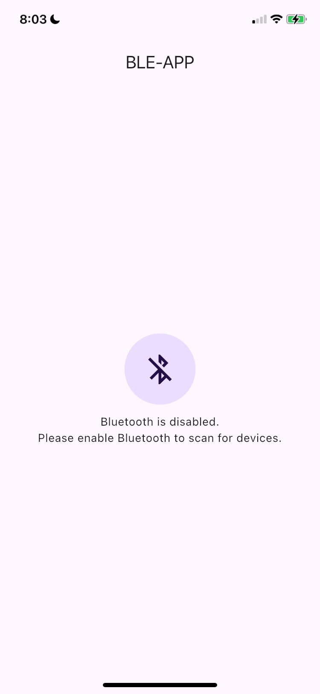
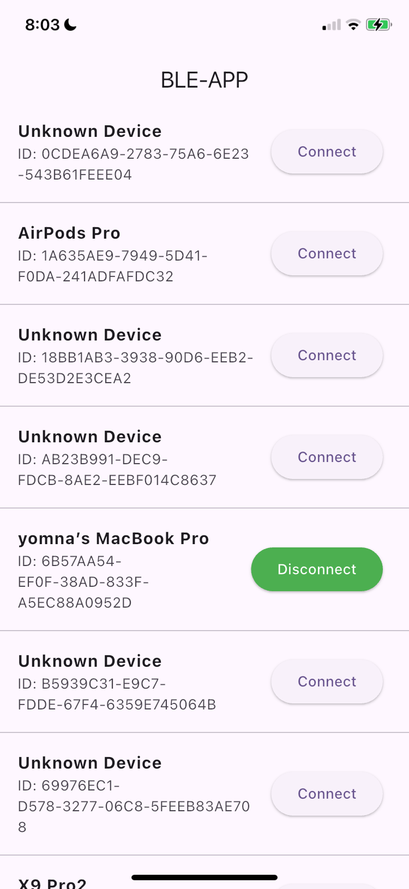
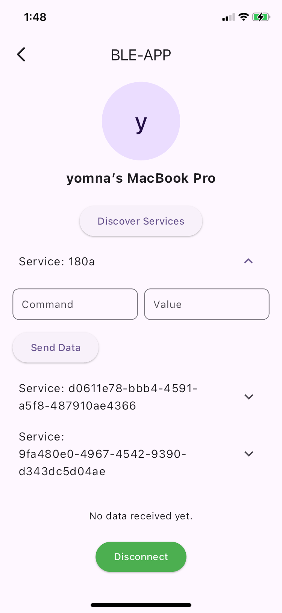

# BLE-APP

A Flutter application for scanning, connecting, and interacting with BLE (Bluetooth Low Energy) devices. The app allows users to scan nearby BLE devices, connect to them, discover services, send data, and receive real-time notifications.

## Features

- **Bluetooth State Management**: Displays whether Bluetooth is enabled and listens for real-time changes.
- **Scan for Devices**: Lists all nearby BLE devices.
- **Connect/Disconnect**: Allows users to connect and disconnect from BLE devices.
- **Discover Services**: Fetches services and characteristics of connected devices.
- **Send Data**: Sends JSON data to a specific BLE characteristic.
- **Receive Data**: Listens for and displays data from BLE notifications.

## Screenshots

### Home Screen

- **Disabled Bluetooth**:
  
- **Device Scanning**:
  

### Device Details

- **Connected Device**:
  

## Folder Structure

The project follows a modular and scalable folder structure:

```
lib
├── core
│   ├── theme
│   │   └── app_theme.dart       # Centralized app theming
│   ├── utils
│       └── size_config.dart    # Utility for responsive UI
├── data
│   ├── models
│   │   └── send_data.dart      # Data model for JSON handling
├── services
│   └── ble.dart                # Bluetooth operations logic
├── presentation
│   ├── provider
│   │   └── ble.dart            # State management with Provider
│   ├── screens
│   │   ├── home.dart           # Home screen for device scanning
│   │   ├── details.dart        # Device details and services
│   │   └── splash.dart         # Splash screen implementation
│   ├── widgets
│       ├── ble_card.dart       # UI for BLE device cards
│       ├── custom_field.dart   # Customized text fields
│       ├── custom_loader.dart  # Loader widget
│       └── display_device.dart # Display selected device details
└── main.dart                   # Entry point of the application
```

## Setup and Installation

1. Clone the repository:
   ```bash
   git clone https://github.com/syomna/ble-app-flutter.git
   ```
2. Navigate to the project directory:
   ```bash
   cd ble-flutter
   ```
3. Install dependencies:
   ```bash
   flutter pub get
   ```
4. Run the application:
   ```bash
   flutter run
   ```

## Dependencies

The app uses the following Flutter packages:

- [flutter_blue_plus](https://pub.dev/packages/flutter_blue_plus) - For managing BLE operations.
- [permission_handler](https://pub.dev/packages/permission_handler) - For managing runtime permissions.
- [provider](https://pub.dev/packages/provider) - For state management.

## Usage

1. Ensure Bluetooth is enabled on your device.
2. Launch the app to see the list of nearby BLE devices.
3. Tap **Connect** to pair with a device.
4. Use the **Discover Services** button to list available services and characteristics.
5. Send data or receive notifications based on the services of the connected device.

## Demo

- [APK Download Link](https://drive.google.com/file/d/1t0g4KdvwmUA4kxcwGMQp8DKdfUdPMVp4/view?usp=sharing)
- [Demo Video](https://drive.google.com/file/d/1oaLbk8Fbdpa6hcMB98I0ymRXgHzmQxtY/view?usp=sharing)
